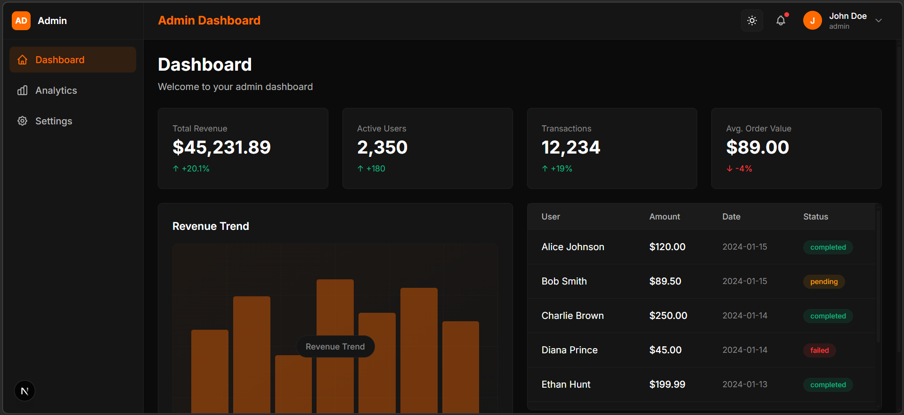

# Admin Dashboard Template

A modern, production-ready admin dashboard template built with **Next.js 16**, **React 19**, **TypeScript**, and **Tailwind CSS v4**. Features a complete theming system, Redux state management, and polished UX with skeleton loaders and micro-interactions.


## 📸 Preview



<p align="center">
  <em>Modern admin dashboard with dark theme, featuring real-time stats, interactive charts, and transaction management</em>
</p>

---

## ✨ Features

### Core Features
- ✅ **Modern Tech Stack**: Next.js 16 (App Router), React 19, TypeScript
- ✅ **Tailwind CSS v4**: Latest CSS-first configuration with `@theme` directive
- ✅ **Dark/Light Mode**: Fully functional theme toggle with localStorage persistence
- ✅ **Redux Toolkit**: Global state management for dashboard data and theme
- ✅ **Responsive Design**: Mobile-first, tablet, and desktop breakpoints
- ✅ **Production-Ready**: Optimized build, no errors, clean console

### UI/UX Features
- 🎨 **Custom Color System**: Orange primary color (#FF6A00) with full theme support
- 📊 **Dashboard Components**: Stats cards, charts, transaction list
- 🔄 **Skeleton Loaders**: Smooth loading states with shimmer animations
- 🎭 **Empty States**: Beautiful zero-data states with call-to-action
- ✨ **Micro-interactions**: Hover effects, active states, smooth transitions
- 📜 **Custom Scrollbar**: Theme-aware scrollbar for dark/light modes

### Pages
1. **Dashboard** (`/dashboard`) - Main overview with stats and charts
2. **Analytics** (`/analytics`) - Data visualization page
3. **Settings** (`/settings`) - User preferences and configuration
4. **Landing** (`/`) - Welcome page with navigation

---

## 🚀 Quick Start

### Prerequisites

- **Node.js**: v18.17+ or v20+
- **npm**: v9+ (or yarn/pnpm)

### Installation

```bash
# Clone the repository
git clone <your-repo-url>
cd frontend

# Install dependencies
npm install

# Run development server
npm run dev
```

Open [http://localhost:3000](http://localhost:3000) in your browser.

---

## 📂 Project Structure

```
frontend/
├── app/                      # Next.js App Router
│   ├── dashboard/           # Dashboard page
│   ├── analytics/           # Analytics page
│   ├── settings/            # Settings page
│   ├── layout.tsx           # Root layout with Redux provider
│   ├── page.tsx             # Landing page
│   └── globals.css          # Global styles + Tailwind config
├── components/
│   ├── dashboard/           # Dashboard-specific components
│   │   ├── StatsCard.tsx
│   │   ├── ChartPlaceholder.tsx
│   │   └── TransactionList.tsx
│   ├── layout/              # Layout components
│   │   ├── DashboardLayout.tsx
│   │   ├── Sidebar.tsx
│   │   ├── Navbar.tsx
│   │   └── UserProfile.tsx
│   └── ui/                  # Reusable UI components
│       ├── Button.tsx
│       ├── Card.tsx
│       ├── ToggleTheme.tsx
│       ├── SkeletonCard.tsx
│       ├── SkeletonTable.tsx
│       ├── SkeletonChart.tsx
│       └── EmptyState.tsx
├── store/                   # Redux store
│   ├── slices/
│   │   ├── themeSlice.ts   # Theme state
│   │   └── dashboardSlice.ts # Dashboard data
│   ├── provider.tsx         # Redux Provider wrapper
│   └── store.ts             # Store configuration
├── hooks/                   # Custom React hooks
│   ├── useAppDispatch.ts
│   └── useAppSelector.ts
├── tailwind.config.ts       # Tailwind configuration
├── postcss.config.mjs       # PostCSS config (Tailwind v4)
└── tsconfig.json            # TypeScript configuration
```

---

## 🎨 Tech Stack

### Frontend Framework
- **Next.js 16.1.1** - App Router, React Server Components
- **React 19.2.3** - Latest React with new hooks
- **TypeScript 5.x** - Type safety

### Styling
- **Tailwind CSS v4.1.18** - Utility-first CSS framework
- **@tailwindcss/postcss** - CSS-first configuration
- **Custom CSS Variables** - Dynamic theming system

### State Management
- **Redux Toolkit 2.11.2** - Global state management
- **React Redux 9.2.0** - React bindings

### Development
- **Turbopack** - Next.js bundler (dev mode)
- **ESLint** - Code linting
- **TypeScript** - Type checking

---

## 🎨 Theming System

### Dark/Light Mode

The dashboard features a complete theming system with:

- **Theme Toggle Button**: Located in navbar
- **localStorage Persistence**: Theme preference saved
- **Smooth Transitions**: 0.3s color transitions
- **CSS Variables**: Dynamic color system

### Color Palette

#### Dark Mode (Default)
```css
--bg-app: #0B0B0B;        /* Main background */
--bg-card: #151515;       /* Card background */
--primary: #FF6A00;       /* Brand color */
--text-primary: #FFFFFF;  /* Primary text */
```

#### Light Mode
```css
--bg-app: #F7F8FA;        /* Main background */
--bg-card: #FFFFFF;       /* Card background */
--primary: #FF6A00;       /* Brand color (same) */
--text-primary: #1A1A1A;  /* Primary text */
```

### Adding Custom Colors

1. **Define CSS variables** in `app/globals.css`:
```css
:root {
  --custom-color: #FF0000;
}
```

2. **Link to Tailwind** in `@theme` directive:
```css
@theme {
  --color-custom: var(--custom-color);
}
```

3. **Use in components**:
```tsx
<div className="bg-custom text-custom">
  Custom colored element
</div>
```

---

## 📦 Components

### Dashboard Components

#### StatsCard
Displays key metrics with trend indicators.

```tsx
import StatsCard from '@/components/dashboard/StatsCard';

<StatsCard
  title="Total Revenue"
  value="$45,231.89"
  trend="+20.1%"
  trendUp={true}
  icon={<DollarIcon />}
/>
```

#### TransactionList
Table/card view of recent transactions.

```tsx
import TransactionList from '@/components/dashboard/TransactionList';

<TransactionList transactions={data} />
```

### UI Components

#### Button
Styled button with variants.

```tsx
import Button from '@/components/ui/Button';

<Button variant="primary" size="md">
  Click Me
</Button>
```

#### Card
Container component with hover effects.

```tsx
import Card from '@/components/ui/Card';

<Card>
  <CardContent>Content here</CardContent>
</Card>
```

#### SkeletonCard
Loading placeholder for cards.

```tsx
import SkeletonCard from '@/components/ui/SkeletonCard';

{isLoading && <SkeletonCard />}
```

---

## 🔧 State Management

### Redux Store Structure

```typescript
{
  theme: {
    mode: 'dark' | 'light'
  },
  dashboard: {
    stats: Array<StatItem>,
    recentTransactions: Array<Transaction>
  }
}
```

### Usage Example

```tsx
import { useAppSelector, useAppDispatch } from '@/hooks';
import { toggleTheme } from '@/store/slices/themeSlice';

function MyComponent() {
  const theme = useAppSelector(state => state.theme.mode);
  const dispatch = useAppDispatch();

  return (
    <button onClick={() => dispatch(toggleTheme())}>
      Toggle Theme
    </button>
  );
}
```

---

## 🎯 Development Guide

### Run Development Server

```bash
npm run dev
```

Server runs on `http://localhost:3000`

### Build for Production

```bash
npm run build
npm run start
```

### Lint Code

```bash
npm run lint
```

### Clear Build Cache

```bash
# Windows PowerShell
Remove-Item -Recurse -Force .next

# Linux/Mac
rm -rf .next
```

---

## 🎨 Styling Guidelines

### Tailwind CSS Best Practices

1. **Use Utility Classes**
```tsx
// ✅ Good
<div className="bg-card p-6 rounded-lg">

// ❌ Avoid inline styles
<div style={{ background: '#151515' }}>
```

2. **Use Theme Variables**
```tsx
// ✅ Good - responsive to theme
<div className="bg-app text-primary">

// ❌ Bad - hardcoded
<div className="bg-black text-orange-600">
```

3. **Responsive Design**
```tsx
<div className="px-4 md:px-6 xl:px-8">
  // Padding increases on larger screens
</div>
```

### Custom Animations

```tsx
// Fade in animation
<div className="fade-in">Content</div>

// Staggered list animation
<div className="fade-in stagger-1">Item 1</div>
<div className="fade-in stagger-2">Item 2</div>
<div className="fade-in stagger-3">Item 3</div>
```

---

## 📸 Screenshots

### Dark Mode


### Light Mode


### Mobile Responsive


---

## 🚢 Production Deployment

### Environment Variables

Setup environment variables for your development and production environments.

#### Quick Start

1. Copy the example file:
   ```bash
   cp .env.example .env.local
   ```

2. Edit `.env.local` with your configuration:
   ```env
   NEXT_PUBLIC_API_URL=http://localhost:5000/api
   ```

#### Available Variables

- **`NEXT_PUBLIC_API_URL`** - Backend API base URL
  - Default (development): `http://localhost:5000/api`
  - Production: Set to your production API URL (e.g., `https://api.example.com/api`)

#### Environment Files

- **`.env.example`** - Template file (committed to git)
- **`.env.local`** - Local development config (ignored by git)
- **`.env`** - Default fallback (ignored by git)

**Note:** All `.env*` files are ignored by git. Never commit sensitive credentials.

#### Production Deployment

Set environment variables in your hosting platform:
- **Vercel**: Project Settings → Environment Variables
- **Netlify**: Site Settings → Environment Variables
- **Docker**: Use `-e` flag or docker-compose.yml

### Build Optimization

The production build includes:
- ✅ Minified JavaScript/CSS
- ✅ Image optimization
- ✅ Code splitting
- ✅ Static generation where possible
- ✅ Server-side rendering for dynamic pages

### Deploy to Vercel

```bash
# Install Vercel CLI
npm i -g vercel

# Deploy
vercel
```

### Deploy to Other Platforms

Standard Next.js deployment works on:
- Vercel
- Netlify
- AWS Amplify
- Docker containers
- Node.js servers

---

## 🔧 Configuration Files

### tailwind.config.ts

```typescript
const config = {
  content: [
    "./app/**/*.{js,ts,jsx,tsx,mdx}",
    "./components/**/*.{js,ts,jsx,tsx,mdx}",
  ],
  // Minimal config - colors defined in globals.css
  plugins: [],
};
```

### postcss.config.mjs

```javascript
const config = {
  plugins: {
    "@tailwindcss/postcss": {},
  },
};
```

### tsconfig.json

Path aliases configured:
- `@/components` → `./components`
- `@/app` → `./app`
- `@/store` → `./store`
- `@/hooks` → `./hooks`

---

## 📚 Key Features Explained

### 1. Tailwind CSS v4 Integration

**Why v4?**
- CSS-first configuration via `@theme` directive
- Better performance
- Simpler setup

**Migration from v3:**
```css
// v3 (tailwind.config.js)
theme: {
  extend: {
    colors: { primary: '#FF6A00' }
  }
}

// v4 (globals.css)
@theme {
  --color-primary: #FF6A00;
}
```

### 2. Skeleton Loading States

Provides visual feedback during data fetching:

```tsx
function Dashboard() {
  const [loading, setLoading] = useState(true);

  if (loading) {
    return (
      <>
        <SkeletonCard />
        <SkeletonCard />
        <SkeletonTable />
      </>
    );
  }

  return <DashboardContent />;
}
```

### 3. Theme-Aware Scrollbar

Custom scrollbar that adapts to dark/light mode:

```css
::-webkit-scrollbar-thumb {
  background: var(--bg-elevated);  /* Changes with theme */
}
```

---

## 🐛 Troubleshooting

### Styles Not Loading

1. **Clear build cache:**
```bash
rm -rf .next
npm run dev
```

2. **Hard refresh browser:**
- Windows/Linux: `Ctrl + Shift + R`
- Mac: `Cmd + Shift + R`

### Theme Toggle Not Working

Check that `localStorage` is available:
```typescript
// app/layout.tsx has this script
localStorage.getItem('theme') || 'dark'
```

### Port Already in Use

Change port in `package.json`:
```json
{
  "scripts": {
    "dev": "next dev -p 3001"
  }
}
```

---

## 📝 To-Do / Future Enhancements

- [ ] Add real chart library (Chart.js, Recharts)
- [ ] Implement authentication (NextAuth.js)
- [ ] Add API integration examples
- [ ] Create component Storybook
- [ ] Add E2E tests (Playwright)
- [ ] Implement data tables with sorting/filtering
- [ ] Add more dashboard widgets
- [ ] Create admin user management page
- [ ] Add notification system
- [ ] Implement dark/light/auto theme

---

## 🤝 Contributing

Contributions are welcome! Please follow these steps:

1. Fork the repository
2. Create a feature branch (`git checkout -b feature/AmazingFeature`)
3. Commit your changes (`git commit -m 'Add some AmazingFeature'`)
4. Push to the branch (`git push origin feature/AmazingFeature`)
5. Open a Pull Request

---

## 📄 License

This project is licensed under the MIT License - see the [LICENSE](LICENSE) file for details.

---

## 🙏 Acknowledgments

- [Next.js](https://nextjs.org/) - The React Framework
- [Tailwind CSS](https://tailwindcss.com/) - Utility-first CSS
- [Redux Toolkit](https://redux-toolkit.js.org/) - State Management
- [Vercel](https://vercel.com/) - Deployment Platform

---

## 📞 Support

For questions or issues:
- Create an issue in the repository
- Contact: [your-email@example.com]

---

## 🎓 Learn More

- [Next.js Documentation](https://nextjs.org/docs)
- [Tailwind CSS v4 Docs](https://tailwindcss.com/docs)
- [Redux Toolkit Docs](https://redux-toolkit.js.org/)
- [TypeScript Handbook](https://www.typescriptlang.org/docs/)

---

**Built with ❤️ using Next.js 16, React 19, and Tailwind CSS v4**
